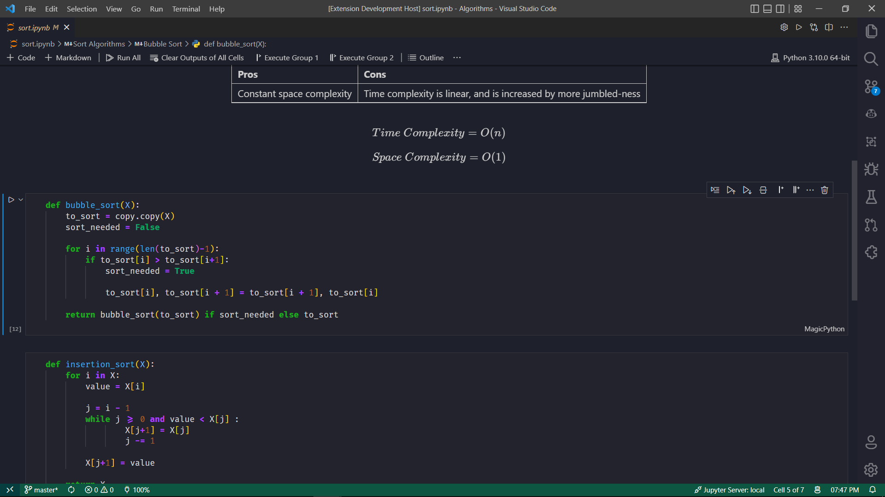

# Better Jupyter Theme

    <forked from sam-the-programmer, added black background and purple f-strings>
    
    The theme seen in Jupyter Notebooks, for VS Code,
    to seemlessly integrate your Jupyter workflows right
    down to the colour theme. It includes light, dark
    and high contrast themes!
    
    Works beautifully on Windows 🏠, MacOS 🍎, Linux 🐧
    and on the Web 🌐!

## Dark Theme

